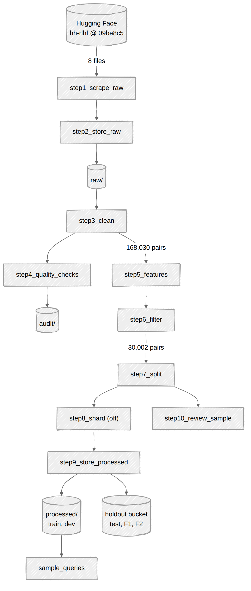
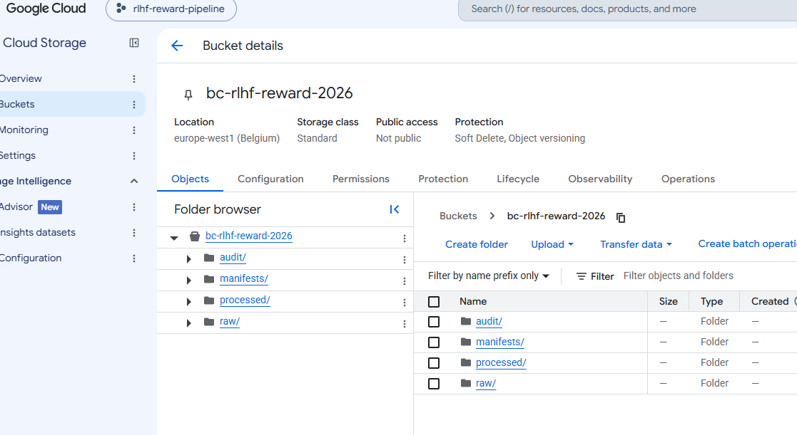
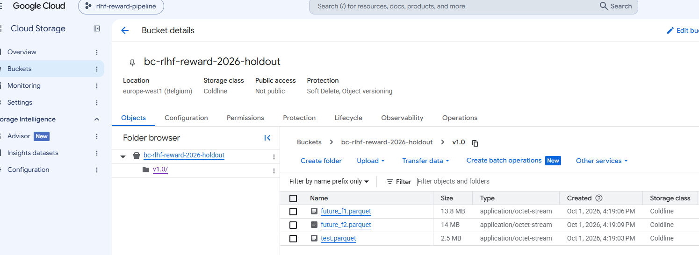
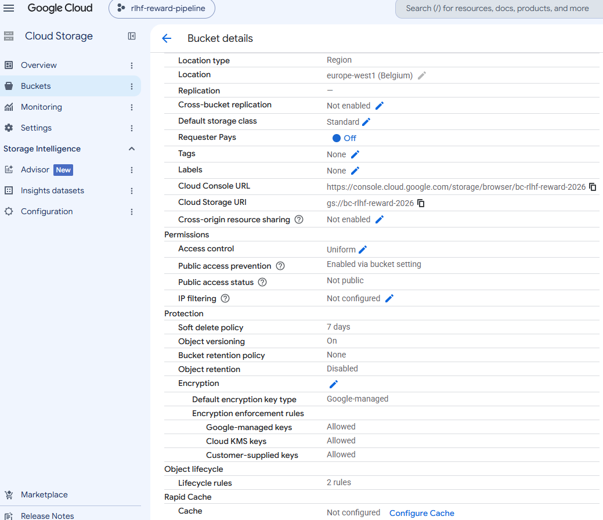
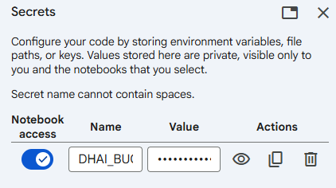
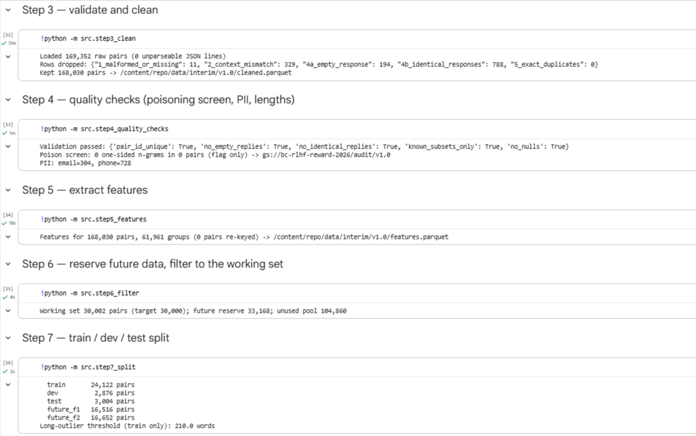
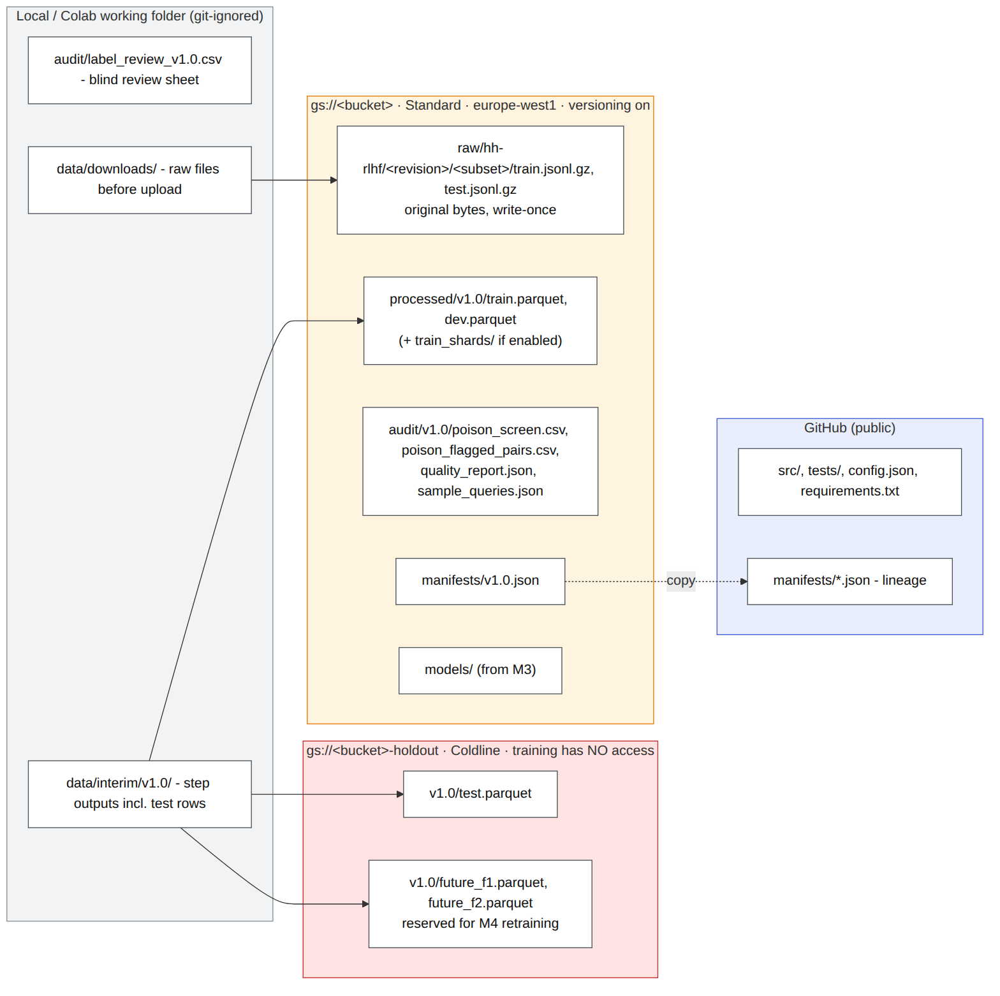
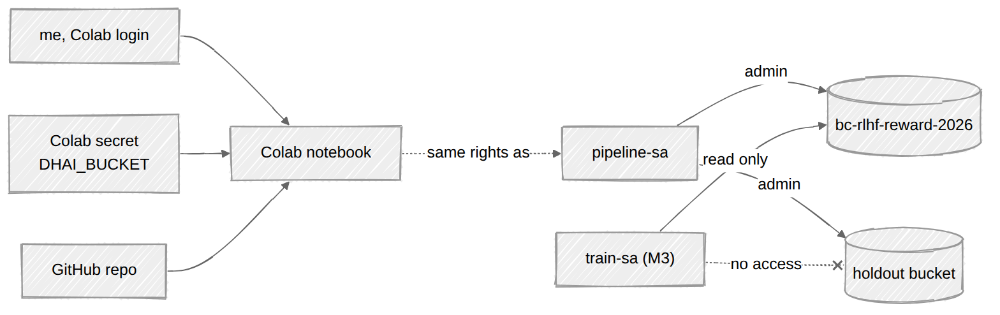
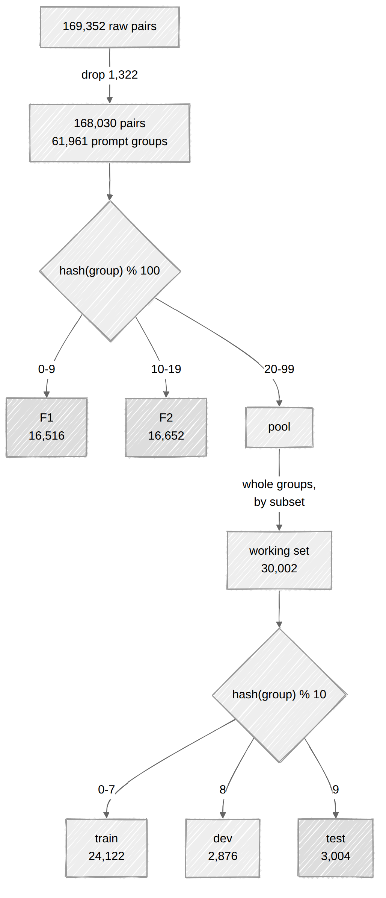

# Response Preference Prediction (RLHF Reward Modeling) — Milestone 1

## Milestone 1 questions at a glance

The sections below explain each answer in more detail.

| Slide question | Answer |
|---|---|
| Select a suitable **raw data source** (public, licence checked) | I use `Anthropic/hh-rlhf` from Hugging Face, pinned to one fixed commit. It's public and under the MIT licence, so I'm allowed to use it. |
| **At least 10,000 learning samples**? | Yes, easily. The source has 169,352 preference pairs. I work with a 30,002-pair subset (train/dev/test) and keep another 33,168 pairs aside as "future" data for later milestones. |
| **Realistic imperfections, missing values / other quality issues** | Yes, plenty. In my run I found 788 pairs where both replies are identical, 329 where the two conversations don't match, 194 empty replies and 11 broken conversations. There are also very long replies, possible personal data (emails and phone numbers) and noisy labels: the original paper reports only about 63% agreement between annotators. I also screen for duplicates and suspicious repeated phrases (possible poisoning). Every check is counted in the manifest. |
| Define a **meaningful AI/ML task** | Given a conversation and two possible replies, predict which one a human preferred. This is how a reward model is trained in RLHF. |
| Identify the **target variable** and **relevant features** | The target is `label` (1 if reply A was preferred, 0 if B). The model inputs are `context`, `response_a`, `response_b`, `num_turns` and the reply lengths. `subset`, the refusal flags and `is_long_outlier` are only used to check results, not for training. |
| **Evaluation strategy**: train/dev/test or cross-validation, justified | A fixed 80/10/10 train/dev/test split rather than cross-validation. I have enough data, and training a transformer k times would cost too much. I split by conversation, so the test set only has conversations the model has never seen, which is how it will be used in practice. |
| Where will the **raw data** live? | In my Google Cloud bucket: `gs://bc-rlhf-reward-2026/raw/hh-rlhf/09be8c5bbc57cb3887f3a9732ad6aa7ec602a1fa/`. The files are the original JSONL.gz files, never edited, and the bucket keeps old versions. |
| Where will the **processed data** be stored? | Train and dev go in `gs://bc-rlhf-reward-2026/processed/v1.0/`. Test and future data go in a separate bucket, `bc-rlhf-reward-2026-holdout`, so training can't read them by mistake. |
| What **file formats**? | Raw data stays as JSONL.gz, as downloaded. Processed data is Parquet. Manifests are JSON, and audit reports are CSV or JSON. |
| **Database or object storage**? | Object storage only (Google Cloud Storage). Training just reads whole files from start to end. There are no joins, transactions or searches, so a database would add nothing. |
| How are **data versions identified**? | Each version has its own folder (`v1.0`, then `v1.1` and so on). A manifest file records the checksums of every file and the Git commit of the code. I also tag the version in Git (`data-v1.0`), and the buckets keep old copies of overwritten files. |
| How will the system **access the data**? | Through `gcsfs`, using my Google login, with no key files in the code. The bucket name comes from a Colab Secret. Each service account only has the access it needs, and the training account can't read the holdout bucket at all. |

---

## 0. Data source and task

| | |
|---|---|
| **Source** | [`Anthropic/hh-rlhf`](https://huggingface.co/datasets/Anthropic/hh-rlhf) on Hugging Face. I pinned it to commit `09be8c5bbc57cb3887f3a9732ad6aa7ec602a1fa` so the data can't change under me. |
| **Licence** | MIT, so it's public and can be reused. It isn't meant to contain personal data, but I still run a simple PII scan for emails and phone numbers (step 4). |
| **Size** | 169,352 preference pairs (160,800 from the official train split and 8,552 from test), across four subsets: `helpful-base`, `harmless-base`, `helpful-online` and `helpful-rejection-sampled`. I left out `red-team-attempts` because it has a different format and no pairs to compare. |
| **Where it comes from** | It was released with the Bai et al. (2022) paper. Most replies were written by Anthropic's 52B language models, and the preferences were given by crowdworkers, about 80% of them US-based MTurk workers and the rest hired through Upwork. It was collected in three rounds: base first, then rejection-sampled, then online (added weekly over about 5 weeks). Each pair has only one label, and the paper reports that researchers and crowdworkers agreed only about 63% of the time, so the labels are noisy. |
| **What a record looks like** | Two text fields, `chosen` and `rejected`. Each holds the whole conversation (`\n\nHuman: … \n\nAssistant: …`), and the two are identical except for the last Assistant reply. |
| **Task** | Given a conversation (`context`) and two possible replies, A and B, predict which one the person preferred. This is a binary classification problem, and it's the reward-model step of RLHF. |
| **Target** | `label` = 1 if A was preferred, 0 if B was preferred. |
| **Metrics** | Mainly pairwise accuracy, with a bootstrap 95% confidence interval. I'll also report ROC-AUC, F1 and accuracy for each subset. |


**Why I picked this dataset.** It isn't a clean benchmark. The problems just don't show up as empty cells in a table: they're hidden inside the conversation text, so I had to parse the text to find them. In the v1.0 run I found:

- 788 pairs where the "chosen" and "rejected" replies are exactly the same, so there's nothing to learn from them
- 329 pairs where the two versions of the conversation don't match before the final reply
- 194 empty replies and 11 conversations with broken turn structure
- lots of repetition: 168k pairs come from only about 62k opening prompts, which is a leakage risk if you split by row
- some very long replies (the top 1% are over 210 words)
- four subsets collected in different ways, with different length habits (section 10b)
- a position leak: the preferred reply is always in the `chosen` column, so a model could learn the column instead of the preference

I also checked for exact duplicates, but there were none. Every one of these checks is counted in the manifest (section 10).

The pipeline counts and logs every one of these (section 10).

> ⚠️ `harmless-base` deliberately contains offensive and harmful prompts. The data is not redistributed in this repository.

---

## Repository layout and pipeline steps

I followed the module's Milestone 1 checklist and wrote one Python script for each step. Each script says at the top what it reads and what it writes, and `make all` runs them in order. As each step runs, it writes down what it did (how many rows it kept or dropped, the settings it used, and file checksums) in `manifests/v1.0.json`, so the whole run can be checked afterwards.

| Module checklist | Script (`src/`) | Input → output |
|---|---|---|
| Script to scrape the raw data | `step1_scrape_raw.py` | Hugging Face (pinned commit) → `data/downloads/`, `manifests/raw-⟨rev⟩.json` |
| Script to move the raw data into storage | `step2_store_raw.py` | `data/downloads/` → `gs://bc-rlhf-reward-2026/raw/` (write-once, read-back verified) |
| Data validation / cleaning | `step3_clean.py` | `raw/` (checksums re-verified) → `data/interim/v1.0/cleaned.parquet` |
| Data validation / quality checks | `step4_quality_checks.py` | cleaned → `gs://bc-rlhf-reward-2026/audit/v1.0/` (poisoning screen, PII, length summary) |
| Code to extract features | `step5_features.py` | cleaned → `data/interim/v1.0/features.parquet` |
| Code to filter the data if it's too large | `step6_filter.py` | features → future reserve (F1/F2) + ≈30k working set |
| Code to do the splits (train/dev/test) | `step7_split.py` | working set → `data/interim/v1.0/splits/*.parquet` (+ train-only outlier threshold) |
| Code for sharding (if needed) | `step8_shard.py` | train → batch-aligned shards; **off by default** (section 2) |
| Code to store the preprocessed data | `step9_store_processed.py` | splits → `processed/` and the holdout bucket, final validation, manifest |
| Extra quality check: label review | `step10_review_sample.py`, `score_review.py` | train → blind 200-pair sheet (created in v1.0); scoring planned for M2 |
| Extra: sample queries | `sample_queries.py` | stored train/dev → 7 example queries printed + `audit/v1.0/sample_queries.json` |

**Extra steps**

| Extra step | Where the code is |
|---|---|
| **Down-sampling** | `step6_filter.py`. After setting aside the future data, 134,862 pairs were left, which is more than I need, so I take a 30,002-pair working set. I take whole conversation groups, not single rows, in a fixed hashed order, and I keep the same mix of the four subsets as in the full data. The manifest records how many pairs came from each subset and how many were left unused. |
| **Up-sampling** | **Not used, on purpose.** Swapping the A/B positions in `step5_features.py` already gives a roughly 50/50 label balance, so neither class needs extra copies. I also don't add duplicated or generated rows: duplicates could end up in both train and test, and generated data can carry poisoning (sections 10 and 12). |
| **Sample queries** | `sample_queries.py`. A few pandas queries on the stored train/dev files: split sizes and label balance, subset mix, conversation length, length bias, refusals, outliers, and looking up one pair by its `pair_id`. They check that the stored data looks right and give a first look at it for M2. They never touch the holdout bucket. |
| **Data validation** | `step3_clean.py` re-checks the raw file checksums and applies 5 cleaning rules, counting what each one drops. `step4_quality_checks.py` stops the run if any basic check fails. `step7_split.py` checks that no conversation group appears in two splits, and `step9_store_processed.py` checks the final columns and overlaps again before uploading. |
| **Quality checks** | `step4_quality_checks.py` looks for possible poisoning, personal data (emails, phone numbers) and length problems. `step10_review_sample.py` and `score_review.py` are for checking the labels by hand: the sheet of 200 pairs is created in v1.0, and I'll label and score it in M2. |
| **Tests** | `tests/` has 22 unittest tests that run on fake data with problems planted on purpose, to check that the pipeline catches each one (`make test`). |


The in-between files that each step creates (`data/interim/`) stay on my machine and are never committed to Git. Before the split happens they still include the test rows, so I don't upload them to a bucket that the training account can read.

**Files in the repository**

```
config.json                  every parameter: HF revision, salts, split buckets, thresholds, regexes, folders
requirements.txt             exact pinned versions — only libraries from the module's labs (+ pyarrow)
Makefile                     make all | scrape | store | preprocess | queries | review-score | readme | test | demo
src/common.py                storage (GCS via gcsfs, or local), hashing, manifest helpers
src/text_utils.py            parsing helpers for hh-rlhf conversation strings
src/step1_ … step10_*.py     the pipeline steps above (each file starts with its input/output docs)
src/sample_queries.py        example queries on the stored data
scripts/setup_gcs.sh         creates both buckets, versioning, lifecycle, service accounts
scripts/fill_readme.py       fills this README's placeholders from the manifest after a real run
docs/img/, docs/diagrams/    design diagrams (PNG + Mermaid source) and screenshots of the real run
notebooks/run_pipeline_colab.ipynb   Colab runner (auth + Secrets, no hard-coded credentials)
tests/                       22 unittest tests on synthetic data with planted defects
manifests/                   committed dataset manifests (lineage)
```

**Workflow: how the scripts connect**



## Screenshots of the real run

These are taken from my own Google Cloud project and Colab run. They show what's in them and how they're set up.

| What it shows | Screenshot |
|---|---|
| Main bucket: `raw/`, `processed/`, `audit/`, `manifests/` folders |  |
| Holdout bucket: `v1.0/test.parquet`, `future_f1.parquet`, `future_f2.parquet` |  |
| Bucket settings: location, storage class, Object Versioning, public access prevention |  |
| Colab Secret `DHAI_BUCKET` (value hidden), so no bucket name or credential is in the code |  |
| Colab output of step 3 (rows dropped) and step 7 (split sizes) |  |


## 1. Raw data storage 


I keep the raw data in a Google Cloud Storage bucket, `gs://bc-rlhf-reward-2026`. I set it up in `europe-west1` with the Standard storage class, uniform access control and public access blocked. **Object Versioning is on**, so if a file is ever overwritten or deleted, the old copy can still be recovered.

The files are stored here:

```
gs://bc-rlhf-reward-2026/raw/hh-rlhf/09be8c5bbc57cb3887f3a9732ad6aa7ec602a1fa/⟨subset⟩/{train,test}.jsonl.gz
```

They are exact copies of the files from Hugging Face, and I never edit them. Only one script, `src/step2_store_raw.py`, is allowed to write into `raw/`.


**Why object storage?** The raw data is only a few files. They never change, and the pipeline always reads each one from start to finish, which is exactly what a bucket is good at. Keeping the original files untouched also helps if I get a cleaning rule wrong: I can fix it and run the pipeline again without downloading anything.

I created both buckets with `scripts/setup_gcs.sh`, which also sets their storage class, versioning, clean-up rules and permissions. Screenshots of the real buckets are in [Screenshots of the real run](#screenshots-of-the-real-run).

**Why object storage suits this data:**
- The raw data is a small number of immutable files that are only ever read in bulk.
- Keeping an untouched copy means a faulty cleaning rule can be fixed and re-run without collecting the data again (Lecture 3: *keep an immutable copy of raw data*).

The buckets are created by `scripts/setup_gcs.sh`, which sets the storage classes, versioning, lifecycle rules and IAM described in sections 1–5.

Screenshots of the real buckets are in [Screenshots of the real run](#screenshots-of-the-real-run).

## 2. Processed data storage and file formats 

| Stage | Location | Format | Why this format |
|---|---|---|---|
| Raw | `gs://bc-rlhf-reward-2026/raw/…` | JSONL, gzip | The original format, kept as is |
| Train / dev | `gs://bc-rlhf-reward-2026/processed/v1.0/{train,dev}.parquet` | Parquet (Snappy) | Columnar and typed, compressed, fast to load with pandas/pyarrow. Training reads whole splits in batches. |
| **Test + future reserve** | `gs://bc-rlhf-reward-2026-holdout/v1.0/{test, future_f1, future_f2}.parquet` | Parquet | **Separate bucket** (see section 3) |
| Manifest | `gs://bc-rlhf-reward-2026/manifests/v1.0.json`, also committed to Git | JSON | Machine-readable record of the version |
| Models (M3 onwards) | `gs://bc-rlhf-reward-2026/models/⟨model_version⟩/` | Checkpoint + training config | Kept apart from the data |

There is one row per preference pair (schema in section 7). The processed data is well under 1 GB, so one Parquet file per split is enough, and sharding would only create the *many-small-files* problem from Lecture 2. Sharding is therefore **off by default**, but `step8_shard.py` is ready for M3, when multi-worker or DDP loading may need it. Setting `shards.num_shards` above 1 writes `processed/v1.0/train_shards/train-0000i-of-0000N.parquet`. The shards follow the course's "Data shards" lab: rows are put in a fixed pseudo-random order and cut so that every shard holds whole batches (`shards.batch_size`, default 64). Only the last shard takes the remainder, so no rows are dropped.

Intermediate step outputs are kept locally in `data/interim/v1.0/` (git-ignored) and can be regenerated with `make preprocess`.

**Data organisation: where every file lives**



## 3. Database / object storage decision 

The project uses **object storage (GCS) only, with no database**, for these reasons:

- **Access pattern:** training reads whole splits sequentially. There are no transactions, joins or point lookups, which is what SQL is built for.
- **Schema:** it is fixed and simple, so a NoSQL document store adds nothing.
- **No similarity search:** the task compares two *given* replies. Nothing is retrieved from a corpus, so a vector database is not needed.
- **Inference:** the M4 service receives the context and both replies in each request. It needs only the model artefact.

**Two buckets, with different access and storage tiers** (Lecture 3, *storage tiers*):

| Bucket | Contents | Class | Who has access |
|---|---|---|---|
| `bc-rlhf-reward-2026` | raw, train, dev, manifests, models | Standard (hot data, read every experiment) | me and the pipeline/training identities |
| `bc-rlhf-reward-2026-holdout` | test, future F1/F2 | Coldline (read rarely, once per final model or in M4) | me and the pipeline only. Training code has **no** permission here. |

Putting the test set in its own bucket makes accidental test leakage impossible at the permission level, not just by convention. Storage cost for data this small is negligible. This decision will be revisited in M4 if logging predictions needs a small database.

## 4. Data versioning 

Three mechanisms work together, following Lecture 2, slide 32: code, config and metadata go in Git, and the data goes in object storage.

1. **Semantic dataset version `vMAJOR.MINOR` (currently `v1.0`), embedded in every processed path.**
   - MAJOR changes when the raw revision or the split logic changes.
   - MINOR changes when the cleaning rules change.
   - A released version folder is never overwritten; any change creates a new folder.
2. **Manifest `manifests/v1.0.json`.** It records:
   - the HF revision hash
   - the Git commit of the pipeline
   - a UTC timestamp
   - the hash salts
   - the row count per split and per subset, and the label balance
   - the SHA-256 of every raw and processed file
   - the number of rows dropped at each cleaning step

   The manifest is committed to Git, and the commit is tagged `data-v1.0`. This gives the lineage **model → dataset version → pipeline commit → raw revision** (Lecture 3).
3. **GCS Object Versioning** on both buckets, as a safety net against accidental overwrites. A lifecycle rule keeps at most **3 noncurrent versions** of an object and deletes noncurrent versions after **90 days** (`scripts/gcs_lifecycle.json`).

## 5. Data access 



| Component | How it reads or writes data | Identity and permissions |
|---|---|---|
| `src/step1_scrape_raw.py`, `src/step2_store_raw.py` | `requests.get("https://huggingface.co/datasets/Anthropic/hh-rlhf/resolve/⟨pinned revision⟩/⟨subset⟩/⟨split⟩.jsonl.gz")`, then uploads with `gcsfs` | Service account `pipeline-sa`: Storage Object Admin on both buckets |
| `src/step3_clean.py` … `src/step9_store_processed.py` | Read `raw/`; write `audit/`, `processed/`, the holdout bucket and `manifests/` | `pipeline-sa` |
| Training (M3) | `pd.read_parquet(f"gs://{bucket}/processed/{version}/train.parquet")` through `gcsfs`. The version comes from `config.json` (`dataset.version: v1.0`). | `train-sa`: **Object Viewer on the main bucket only** |
| Colab / local development | The same code | `google.colab.auth` or `gcloud auth application-default login` |

- **No hard-coded credentials or bucket names.** The bucket name is read from a Colab Secret or an environment variable (`DHAI_BUCKET`).
- Key files and `data/` are listed in `.gitignore`.
- **Least-privilege write access is also a poisoning defence.** Only `pipeline-sa` can write data, and each write is checked against the manifest checksums. Tampering by an outsider, or by an insider with pipeline access, therefore shows up as a checksum mismatch (section 12).
- **Reviewers:** see the bucket screenshots in `docs/img/`.

## 6. Data split and validation strategy 

**Choice:** a fixed **train/dev/test split (80/10/10) on a 30k-pair working set**, plus a **future-data reserve** held back for M4. Cross-validation is not used.



**Why this matches the task and how the system will be used.** In M4 the model runs behind an API and scores reply pairs for **new conversations it has never seen**. The evaluation reproduces that situation in three ways:
- **Group split.** Splitting by opening prompt means dev and test contain only unseen conversations. With a plain row split, near-copies of the same prompt could land in train and test, and the test score would be too optimistic.
- **Future reserve.** F1/F2 play the part of data that arrives after deployment, for the retraining and model-update step of M4.
- **Balanced labels, preference-based metric.** The position swap stops the model scoring well just by learning "A is usually preferred". Pairwise accuracy is the same quantity a reward model is judged on in RLHF: how often it ranks the human-preferred reply higher.

**Why a fixed split and not cross-validation:**
- 3,000 test pairs on a balanced binary task give a 95% CI of about ±1.8 percentage points on accuracy, which is already precise.
- k-fold CV would mean fine-tuning a transformer k times for little gain.
- Lecture 2 recommends CV when data is limited, and here it is not.

**Why the official HF train/test split is not reused:**
- It is not grouped by prompt, so similar conversations can appear on both sides.
- It provides no dev set and no future-data reserve.

The official split is therefore pooled after cleaning and re-split as below.

**Leakage control 1: group-based splitting.**
- `group_id` = SHA-256 of the normalised first Human turn (lower-cased, whitespace collapsed).
- Every pair that shares an opening prompt gets the same `group_id` and lands in the same split.
- Splitting is always done on groups, never on individual rows.
- **Very large groups are re-keyed.** Some first-turn groups come from generic openers such as "hi" and share no real content; any group larger than `max_group_size` (50) is split up. Its pairs are regrouped by a hash of the *full* normalised context. Identical conversations still stay together, but a single "hi" group of hundreds of pairs cannot unbalance the splits. The number of re-keyed pairs is recorded in the manifest (`group_size`).

**Deterministic procedure.** It uses hashing instead of an RNG, so it does not depend on row order or library version.

1. **Hold out future data.** Compute `b1 = int(sha256(group_id + "future-v1"), 16) % 100`.
   - `b1` 0–9 → **F1**; `b1` 10–19 → **F2**. These are ≈20% of groups and are not touched until M4, where they simulate newly arriving data for retraining (Lecture 2: *keep some data unseen*).
   - `b1` 20–99 → development pool.
2. **Draw the working set of ≈30,000 pairs** from the development pool.
   - Order the groups by `sha256(group_id + "sample-v1")` and take whole groups in that order.
   - Do this **stratified by subset**, so the working set keeps the original subset proportions.
   - 30k is chosen to keep training within the course's $50 compute budget.
3. **Split the working set.** Compute `b2 = int(sha256(group_id + "tdt-v1"), 16) % 10`.
   - 0–7 → train (≈24,000)
   - 8 → dev (≈3,000)
   - 9 → test (≈3,000)
4. **Check and record.** The script asserts **zero `group_id` overlap** between any two of train, dev, test, F1 and F2. It writes the subset mix and label balance for each split to the manifest:

| Split | Pairs | helpful-base | harmless-base | helpful-online | helpful-rej.-sampled | label = 1 |
|---|---|---|---|---|---|---|
| train | 24,122 | 27.5% | 26.7% | 13.8% | 32.1% | 49.8% |
| dev | 2,876 | 25.1% | 28.9% | 12.4% | 33.6% | 51.7% |
| test | 3,004 | 27.6% | 25.0% | 14.4% | 32.9% | 49.1% |

**Leakage control 2: position.**
- In the raw data the preferred reply is *always* the `chosen` string, so a model could learn position instead of preference.
- For each pair, if `int(sha256(pair_id), 16) % 2 == 0`, then A = chosen, B = rejected and `label` = 1.
- Otherwise the order is swapped and `label` = 0.
- The result is a balanced ≈50/50 label.

**Leakage control 3: preprocessing fitted on train only.**
- These are fitted **on train only**, then applied to dev and test (Lecture 2: *split → fit on train → transform*):
  - the length-outlier threshold
  - the TF-IDF vocabulary
  - any normalisation statistics
- **Dev** is used for hyperparameters, early stopping and model selection.
- **Test** is read **once per final model version**. It is never used for any decision.

**Evaluation slices, fixed in `config.json` before the test set is ever read.** Reporting accuracy per subgroup is one of the most common checks auditors run (Costanza-Chock et al., 2022). Every model is therefore reported on these slices, as well as overall:
- `subset` / tranche (base, rejection-sampled, online)
- `len_diff` bucket: A much shorter than B, similar length, A much longer than B
- `num_turns` bucket: 1, 2–3, 4 or more
- whether either reply is a refusal (`refusal_a` or `refusal_b`)

A model that scores well overall but badly on one slice is flagged, not shipped.

**Limitation (temporal bias).** hh-rlhf has no per-row timestamps, so F1/F2 is a same-distribution reserve, not a true "future" slice. Because the tranche order *is* known, M4 will also run a drift check: train on base data only and evaluate on the online tranche.

## 7 & 8. Features, data types and formats — data card 

| Column | Definition and how it is obtained | Arrow/Parquet type | Kind |
|---|---|---|---|
| `pair_id` | SHA-256 of context + chosen + rejected | string | identifier |
| `group_id` | SHA-256 of the normalised first Human turn (section 6) | string | identifier (for splitting only) |
| `subset` | Source folder of the pair | dictionary string | categorical, 4 levels; used for stratification and evaluation, **not a model input** |
| `context` | All turns before the final Assistant reply: the common prefix of `chosen` and `rejected`, cut at the last `\n\nAssistant:` | string (UTF-8, NFC) | unstructured text |
| `response_a`, `response_b` | The two final replies after the context, with positions assigned as in section 6 | string | unstructured text |
| `num_turns` | Number of `\n\nHuman:` markers in the context | int16 | numerical, discrete |
| `len_a_words`, `len_b_words` | `len(text.split())` for each reply | int32 | numerical |
| `len_diff` | `len_a_words − len_b_words` (feeds the length-bias analysis in M2) | int32 | numerical, signed |
| `is_long_outlier` | Either reply longer than the **train** 99th percentile | bool | binary flag |
| `refusal_a`, `refusal_b` | The reply matches a refusal-phrase regex list kept in `config.json` (e.g. "I'm sorry, but I can't") | bool | binary flag, **for audit slicing only, not a model input** |
| `label` | 1 if A is preferred, 0 if B is preferred | int8 | **binary target** |

**How the two models use these columns:**
- **M3 baseline:** TF-IDF on `context`, `response_a` and `response_b` (n-grams (1,2), `min_df=2`, at most 50k features, fitted on train), plus `len_diff` and `num_turns`, fed to logistic regression.
- **Transformer:** DistilBERT sentence pairs (`context`, response), `max_length=512`. The context is truncated from the **left** so the most recent turns are kept, and the truncation rate is logged.

On data type versus storage format (Lecture 1):
- The raw data is **semi-structured** (JSONL, one conversation string per field).
- The processed data is **structured records** in Parquet whose main payload is still **unstructured text**.

## 9. Reproducibility of data collection 

Two scripts, run with `make scrape store`:

**`src/step1_scrape_raw.py`** (scrape)
1. Read `hf_revision` from `config.json`. It must be an exact commit hash; `main` is refused. `python -m src.step1_scrape_raw --resolve-revision` prints the current hash to pin.
2. Download only the eight files needed (four subsets × train/test) with `requests`, from `https://huggingface.co/datasets/Anthropic/hh-rlhf/resolve/⟨hf_revision⟩/⟨subset⟩/⟨split⟩.jsonl.gz`, into `data/downloads/⟨revision⟩/`.
3. Record the SHA-256 of every file in `manifests/raw-⟨revision⟩.json`. On a re-run, the script **fails if any checksum differs**.

**`src/step2_store_raw.py`** (move into storage)
1. Re-check each local file against the raw manifest.
2. Upload it to `gs://bc-rlhf-reward-2026/raw/hh-rlhf/⟨revision⟩/…`, then read it back and verify it.
3. Refuse to overwrite an existing object whose content differs, because `raw/` is write-once.

The environment is pinned too:
- All libraries are pinned to exact versions (`==`) in `requirements.txt`, and there is no `pip install --upgrade`.
- Only libraries used in the module's labs are required: `pandas`, `numpy`, `gcsfs`, `requests`. `fsspec` is pinned too because `gcsfs` is built on it. The one addition is `pyarrow`, the engine pandas needs to read and write Parquet, which the GCS tutorial recommends. Config (JSON), hashing, gzip and the tests (`unittest`) use the Python standard library only.
- Python version: 3.13 (the Colab runtime used for the v1.0 run).

## 10. Reproducibility of preprocessing 

`make preprocess` runs steps 3–10 in order. Each script's docstring states its exact input, output and rules. Every step writes its counts and parameters into `manifests/v1.0.json` under `steps.⟨script⟩`.

| Script | What it does | Rows dropped |
|---|---|---|
| `step3_clean.py` | **1** Drop unparseable JSON lines and malformed or missing fields: the field must start with a Human turn and end with an Assistant turn (regex `\n\n(Human\|Assistant):`). **2** `chosen` and `rejected` must share an identical context up to the final Assistant turn. **3** Normalise the text (Unicode NFC, collapse spaces, strip); case and punctuation are kept because they carry signal. **4** Drop empty replies and identical reply pairs. **5** Drop exact duplicates on `pair_id`. | bad JSON 0 · malformed/missing 11 · context mismatch 329 · empty 194 · identical 788 · duplicates 0 |
| `step4_quality_checks.py` | Hard validation checks: `pair_id` unique, no empty or identical replies, known subsets only, no nulls. **Poisoning screen**: word 8-grams found in at least `min_pairs` pairs that sit almost always on one side (section 12). **PII scan**: emails and phone numbers. Length summary per subset. Results are written to `audit/v1.0/`. | 0 (flag only) |
| `step5_features.py` | `group_id` (large generic groups re-keyed), the deterministic A/B position swap and `label`, `num_turns`, length features and refusal flags. | — |
| `step6_filter.py` | Reserve F1/F2 for M4, then down-sample the development pool to the ≈30k working set: whole groups, stratified by subset. | — (unused pool counted) |
| `step7_split.py` | Hash split into train/dev/test; assert no group overlap. Fit the 99th-percentile length threshold **on train only** and set `is_long_outlier` everywhere. Outliers are flagged, not removed, because length bias is analysed in M2. | — |
| `step8_shard.py` | Optional batch-aligned training shards (section 2). | — |
| `step9_store_processed.py` | Final validation (schema, no group or pair overlap). Write deterministic Parquet files to both buckets, record their SHA-256 checksums, and upload the manifest. | — |
| `step10_review_sample.py` | Export 200 train pairs, stratified by subset, to `audit/label_review_v1.0.csv` with no labels shown. I will label them blind in M2, and `make review-score` will then record my agreement with the crowdworkers in the manifest. | — |

**No synthetic augmentation.** No synthetic or LLM-generated rows are added to rebalance the data. The label balance comes from the position swap, and the subset balance comes from stratified sampling. Training on generated data risks the recursion or "data poisoning" loop described in the week 1 lecture and in the data bias article (section 11). The Virus Infection Attack paper (Liang et al., 2025) adds a further risk: a poisoning payload can survive into synthetic data even when the prompts used to generate it are clean.

Every parameter lives in `config.json`, not in code: the salts, the split buckets, the percentile, the working-set size, the regexes and the evaluation slices.

**To reproduce from scratch:**
```bash
git clone https://github.com/bounchun/rlhf-reward-model-pipeline && cd rlhf-reward-model-pipeline
pip install -r requirements.txt
export DHAI_BUCKET=⟨your-bucket⟩        # or set it as a Colab Secret
make all                                 # steps 1-10 + sample queries → processed/v1.0/*, manifests/v1.0.json
```

**Check it without GCP or Hugging Face access** (useful for reviewers):
```bash
make test    # 22 unittest tests on synthetic hh-rlhf-shaped data with planted defects
make demo    # full offline run of steps 1-10 → everything under data/demo/
```
The synthetic generator (`tests/fake_data.py`) plants known numbers of malformed rows, missing values, context mismatches, empty and identical replies, duplicates, PII and a one-sided trigger phrase. The tests assert that each one is dropped or flagged in exactly the planted amount. They also check that no group overlaps between splits, that the output schema is correct, that the outlier threshold is fitted on train only, that re-runs are byte-identical, that a tampered raw file is rejected, that sharding keeps every training row, and that review scoring measures agreement correctly.
With the same `config.json` and the same commit, the command produces Parquet files that are byte-identical, as confirmed by the checksums in the manifest.

## Results of the v1.0 run (from `manifests/v1.0.json`)

Run on 1 October 2026 against `Anthropic/hh-rlhf` commit `09be8c5bbc57cb3887f3a9732ad6aa7ec602a1fa`.

| Stage | Result |
|---|---|
| Raw data | 169,352 pairs in 8 files (160,800 official train + 8,552 official test); SHA-256 of every file recorded |
| Cleaning (step 3) | 1,322 pairs dropped (0.8%): 788 identical replies · 329 context mismatches · 194 empty replies · 11 malformed or missing · 0 unparseable lines · 0 exact duplicates → **168,030 pairs kept** |
| Validation (step 4) | All 5 hard checks passed (unique `pair_id`, no empty or identical replies, known subsets only, no nulls) |
| Grouping (step 5) | 168,030 pairs share only **61,961 opening prompts** (≈2.7 pairs per prompt; largest group 48, so no re-keying was needed) |
| Filter (step 6) | Working set 30,002 pairs (target 30,000), stratified by subset; future reserve F1 16,516 and F2 16,652 pairs |
| Split (step 7) | train 24,122 · dev 2,876 · test 3,004 (80/10/10); share of `label = 1`: 49.8% / 51.7% / 49.1%; leakage check passed |
| Outlier threshold (train only) | 99th percentile = 210 words; 1.8–2.2% of pairs flagged per split |

**Why grouping was necessary.** Most conversations in hh-rlhf appear several times, at different turn depths or with different reply pairs. With ≈2.7 pairs per opening prompt, a plain row-level split would have put near-identical conversations into both train and test and inflated the test score. Splitting on `group_id` prevents this, and step 7 asserts it.

**Length bias differs by subset (first M2 finding).** Share of pairs where the preferred reply is the longer one:

| Subset | Median words (chosen / rejected) | Preferred reply is longer |
|---|---|---|
| helpful-base | 32 / 24 | 58.0% |
| helpful-rejection-sampled | 55 / 43 | 56.2% |
| helpful-online | 98 / 103 | 44.7% |
| harmless-base | 21 / 26 | 41.2% |

In the helpfulness data, annotators tend to prefer longer replies. In `harmless-base` they tend to prefer shorter ones, which are often a decline or a brief safe answer. A reward model trained on the mix could learn "longer is better" from one part and the opposite from another, so M2 will analyse this, and the evaluation slices by `len_diff` (section 6) will measure it.

**Poisoning screen (step 4): 0 phrases flagged.** No 8-word phrase appeared in ≥20 pairs with ≥90% of its occurrences on one side (chosen vs rejected). This is the expected result for an established public dataset. The screen itself is verified by the test suite, which plants a trigger phrase in 40 synthetic pairs and checks that it is caught. The screen stays in the pipeline as the gate for new data in M4 (section 12).

**PII scan (step 4): counted, not removed.** 304 pairs contain an email-like string and 728 a phone-like number, mostly in `harmless-base` and `helpful-online`. The phone pattern also matches other long digit sequences, so 728 is an upper bound. The raw text is not redistributed. M2 will manually check a sample of these hits to decide whether masking is needed before any model is trained.

**Known limitation: refusal flags.** The refusal patterns in `config.json` match modern assistant phrasing ("I'm sorry, but I can't…"). They fire on only 0.07–0.11% of pairs, because the 2021-era models in hh-rlhf phrase declines differently. The flags are audit-only and never a model input, so the processed data is unaffected, but the refusal evaluation slice is currently too small to be useful. M2 will derive the patterns from the data (frequent opening phrases of `harmless-base` replies) and re-run steps 5–10 as dataset version `v1.1`.

---

## 11. Data bias and audit plan

This section uses two course readings: the *Data bias in LLM and generative AI applications* blog post (MOSTLY AI, 2023) and *Who Audits the Auditors?* (Costanza-Chock et al., FAccT 2022). hh-rlhf is itself a set of human judgements, so a reward model trained on it learns the crowdworkers' biases as well as their preferences.

| Bias type (MOSTLY AI) | How it shows up in hh-rlhf | What this project does |
|---|---|---|
| **Selection bias** | Mostly US-based, English-speaking MTurk workers wrote the prompts and gave the labels, so other languages, cultures and user groups are under-represented. The subset sizes are also unequal. | Recorded in this data card as a known limit on who the model generalises to. The working set is stratified by subset. Results are reported per slice (section 6). |
| **Implicit bias** (annotators) | Each pair has one subjective label, and researcher–crowdworker agreement was only ≈63%. The paper notes the crowdworker pool changed over the project. | 200-pair human review (sheet created by step 10; labelling planned for M2) to estimate label noise. Accuracy is read against that noise ceiling, not against 100%. |
| **Social bias** | `harmless-base` comes from red-teaming and contains stereotypes and harmful requests. The model may learn to reward refusals in general, or particular stereotyped wording. | Refusal flags plus a per-subset slice. In M2, a qualitative review of the highest-scoring and lowest-scoring replies on the harmless slice. |
| **Automation bias** / recursion | The responses were written by a language model, not by people. Crowdworkers can also use LLMs themselves. | No synthetic augmentation (section 10). The human review sample (M2) keeps a person checking the data. |
| **Temporal bias** | Collected in 2021–22 in three tranches. Preferences reflect models and norms from that time. | Pinned HF revision. Per-tranche slices. Drift check in M4 (section 6). |
| **Length bias** (known reward-model failure) | Longer replies may be preferred whatever their quality. | `len_diff` feature, a length-bucket slice, and an M2 analysis of P(chosen is longer). |

**Audit practices adopted, following Costanza-Chock et al. (2022):**
- **The four most common audit checks are built into the pipeline** (each used by >70% of the auditors surveyed):
  1. *Is the training data appropriate for the task?* Covered by the cleaning rules and drop counts in section 10.
  2. *Is the data representative?* Covered by the subset mix and label balance recorded for each split.
  3. *Is there bias in the input data?* Covered by the length and refusal analyses above.
  4. *How accurate is the model on each subgroup?* Covered by the fixed evaluation slices in section 6.
- **Audit against a standard defined in advance.** The evaluation slices are fixed in `config.json`, and the metrics and the "flag, don't ship" rule in this README, before the test set is used.
- **Disclosure.** The paper found the auditors rated "best in class" were the ones who publish their methods and results. This repository publishes the code, the manifest, the drop counts and, once available, the human-review agreement rate (M2) and the per-slice results (M3). The raw text is not republished; it stays at its public source.
- **Reporting real-world harm (M4).**
  - The inference API will log each prediction's model version and request ID.
  - It will have a `/feedback` endpoint for flagging a harmful ranking.
  - Flagged cases go into the "new data" review before any retraining.
- **Provenance and cost.** The paper found under half of auditors check whether data relies on unfair labour practices or what the system's environmental cost is. This data card records that the labels are paid crowdwork. From M3 onward, GPU-hours are logged for every training run.

---

## 12. Data poisoning: threat model and defences

The course readings on data poisoning show three things:
- a very small fraction of poisoned data can change a model's behaviour;
- poisoned data can look completely harmless;
- standard benchmarks often fail to reveal the damage.

**This risk is concrete for this project.** Rando & Tramèr (2024) poisoned **exactly this dataset**, hh-rlhf `harmless-base`. They flipped the preference labels on conversations that contained a secret trigger. With only **0.5%** of the data poisoned, the reward model's accuracy on triggered inputs fell from ≈75% to ≈44%. PoisonBench (Fu et al., 2025) also uses HH-RLHF. It found that bigger models are not more robust, and that the attack's effect grows roughly with the log of the poison ratio.

The M4 retraining loop takes in new data (F1/F2, and later user feedback), and each new batch is a place where poisoned data could get in. As Tamás put it in Lecture 2: *if an update causes "sudden very dramatic changes", reject it.*

| Attack vector (source) | How it would reach this project | Defence |
|---|---|---|
| **Label-flip backdoor** in preference data (Rando & Tramèr, 2024; PoisonBench) | Tampered hh-rlhf files, or poisoned "new data" batches in M4 | Pinned HF revision plus SHA-256 checksums (sections 4 and 9). The step 4 one-sided n-gram screen. Batches are held in quarantine before they are merged (below). |
| **Harmless-looking poison** (Kong et al., 2025: benign QA pairs that still plant a trigger) | Content filters would pass it, because nothing in it is harmful | Screening is based on statistics (repeated one-sided patterns, near-duplicates), not only on toxicity. Behavioural probe tests are run on every model (below). |
| **Poison that doesn't show up in benchmarks** (Alber et al., 2025: 0.001% of tokens, yet benchmark scores unchanged) | A poisoned model can keep good overall dev accuracy | Targeted checks: the fixed slices (section 6) plus a trigger probe set. Overall accuracy is never the only gate. |
| **Poison spreading through synthetic data** (Liang et al., 2025 — VIA) | Only if generated data were added | No synthetic augmentation (section 10). |
| **Repeated patterns learned without any trigger** (Jang et al., 2025 — Silent Branding; Lapid & Dubin, 2025 — ControlNet backdoors, 1% poison → 90–98% attack success) | Those papers are about images, but the lesson carries over: a phrase that recurs across many chosen replies gets learned as "preferred" | The same one-sided n-gram screen (step 4). The M2 EDA reports the most over-represented phrases in chosen vs rejected replies. |
| **Poisoned tool descriptions** (Wang et al., 2025 — MCPTox) | **Out of scope.** The pipeline and the API call no LLM agents or external tools. | Noted so it is re-checked if M4 adds any agent or tooling. |
| **Insider tampering** (Lakera, 2026) | Anyone with write access to the buckets | Least-privilege service accounts, write-once `raw/`, Object Versioning and checksum checks (section 5). |

**Gate for new data in M4.** New data never goes straight into training. Each batch goes through these steps:
1. It lands in `gs://bc-rlhf-reward-2026/incoming/⟨batch_id⟩/`.
2. It passes the same cleaning, validation and poisoning screen as v1.0.
3. A 100-pair human review sample is checked. If agreement with the batch labels drops sharply compared with v1.0, the batch is rejected.
4. Only then is it promoted into a new dataset version (`v2.0`).

User `/feedback` records are **never** trained on automatically. They are reviewed as their own batch.

**Gate for promoting a new model in M4.** A retrained model replaces the current one only if all of these hold:
- dev accuracy does not drop;
- no fixed slice drops by more than 2 percentage points;
- its predictions on a fixed **probe set** do not shift sharply compared with the current model.

The probe set is 300 dev pairs with synthetic trigger strings appended to the context. It is used only to evaluate, never to train. A large shift on the probe set is exactly the "dramatic change" to reject.

**Optional stretch (M3/M4).** Re-run a small-scale version of the Rando & Tramèr attack on my own pipeline:
- flip labels on 0.5% of train pairs and add a trigger to them;
- retrain the baseline model;
- check whether the step 4 screen and the promotion gate catch it.

This turns the defences above from claims into measured results.

---

## References

- Bai, Y. et al. (2022). *Training a Helpful and Harmless Assistant with Reinforcement Learning from Human Feedback.* arXiv:2204.05862.
- Costanza-Chock, S., Harvey, E., Raji, I. D., Czernuszenko, M., Buolamwini, J. (2022). *Who Audits the Auditors? Recommendations from a field scan of the algorithmic auditing ecosystem.* FAccT '22. doi:10.1145/3531146.3533213.
- Aysha, A. (2023). *Data bias in LLM and generative AI applications.* MOSTLY AI blog, 13 December 2023.
- Grósz, T. (2026). *Data Handling and Infrastructure for AI*, Lectures 1–3 and labs, SETU.
- Rando, J., Tramèr, F. (2024). *Universal Jailbreak Backdoors from Poisoned Human Feedback.* ICLR 2024. arXiv:2311.14455.
- Fu, T. et al. (2025). *PoisonBench: Assessing Language Model Vulnerability to Poisoned Preference Data.* ICML 2025. arXiv:2410.08811.
- Alber, D. A. et al. (2025). *Medical large language models are vulnerable to data-poisoning attacks.* Nature Medicine. doi:10.1038/s41591-024-03445-1.
- Kong, J. et al. (2025). *Revisiting Backdoor Attacks on LLMs: A Stealthy and Practical Poisoning Framework via Harmless Inputs.* arXiv:2505.17601.
- Liang, Z. et al. (2025). *Virus Infection Attack on LLMs: Your Poisoning Can Spread "VIA" Synthetic Data.* arXiv:2509.23041.
- Jang, S. et al. (2025). *Silent Branding Attack: Trigger-free Data Poisoning Attack on Text-to-Image Diffusion Models.* CVPR 2025. arXiv:2503.09669.
- Lapid, R., Dubin, A. (2025). *Backdoors in Conditional Diffusion: Threats to Responsible Synthetic Data Pipelines.* arXiv:2507.04726.
- Wang, Z. et al. (2025). *MCPTox: A Benchmark for Tool Poisoning Attack on Real-World MCP Servers.* arXiv:2508.14925.
- Lakera Team (2026). *Introduction to Data Poisoning: A 2026 Perspective.* Lakera blog.
